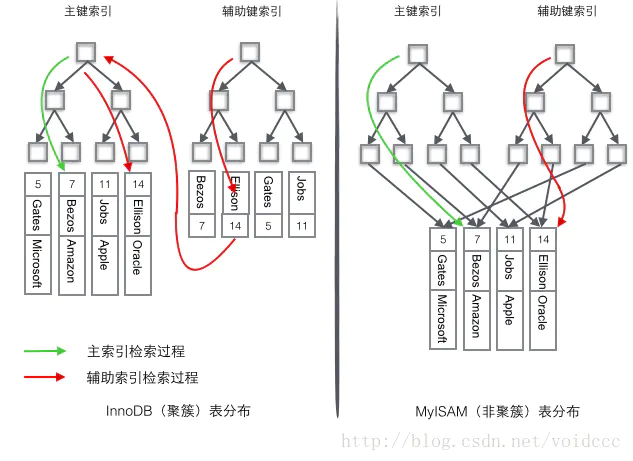

# redis

## 什么是跳表

```c++
https://blog.csdn.net/yjw123456/article/details/105159817/

1.定义：跳表在原有的有序链表上面增加了多级索引，通过索引来实现快速查找。
2.优点：跳表不仅能提高搜索性能，同时也可以提高插入和删除操作的性能。
3.节点结构：  
private class Node 
{
    //保存值
    E data;
    //保存了每一层上的节点信息，可能为null
    List<Node> forwards;

    Node(E data) {
        this.data = data;
        forwards = new ArrayList<>();
        //事先把每一层都置为null，虽然空间利用率没那么高，但是简化了实现
        //也可以通过自定义列表(比如B树实现中用到的Vector)来实现，就可以不用下面的操作
        for (int i = 0; i <= maxLevel; i++) {
            forwards.add(null);
        }
    }

    @Override
    public String toString() {
        return data == null ? " " : "" + data;
    }

    /**
     * 得到当前节点level层上的下一个(右边一个)节点
     *
     * @param level
     * @return
     */
    Node next(int level) {
        return this.forwards.get(level);
    }
}
4.查询的复杂度为 O(log n) 
    起始于顶层,由上层往下层，一直往前，不行就往下
5.插入的复杂度为 O(log n)
    随机生成待插入节点的层数，PROBABILITY =0.5。层数返回1的概率是 0.5；返回2的概率是 0.25；返回3的概   率是 0.125； 
6.删除的复杂度为 O(log n)
    所有的平衡的二叉树(也包括多叉树，如B树）删除算法都是最难的，跳表删除操作简单。
7.假设原始链表大小为 n,那么第1层索引大约有1/2个节点，第2层有1/4个节点，依次类推，直到最后剩下2个节点，   总数为：n/2 + n/4 + n/8 + . . . + 8 + 4 + 2 = n − 2 ，因此空间复杂度是 O(n)
```

## Redis有序集合zset的底层实现

```c++
1.zset的底层分别使用ziplist（压缩链表）和skiplist（跳表）实现。
2.当zset满足以下两个条件的时候，使用ziplist：保存的元素少于128个,保存的所有元素大小都小于64字节
不满足这两个条件则使用skiplist。
3.ziplist 编码的有序集合对象使用压缩列表作为底层实现，每个集合元素使用两个紧挨在一起的压缩列表节点来保存，第一个节点保存元素的成员，第二个节点保存元素的分值。并且压缩列表内的集合元素按分值从小到大的顺序进行排列，小的放置在靠近表头的位置，大的放置在靠近表尾的位置。
4.其实有序集合单独使用字典或跳跃表其中一种数据结构都可以实现，但是这里使用两种数据结构组合起来，原因是假如我们单独使用 字典，虽然能以 O(1) 的时间复杂度查找成员的分值，但是因为字典是以无序的方式来保存集合元素，所以每次进行范围操作的时候都要进行排序；假如我们单独使用跳跃表来实现，虽然能执行范围操作，但是查找操作有 O(1)的复杂度变为了O(logN)。因此Redis使用了两种数据结构来共同实现有序集合。这两种数据结构会通过指针来共享相同元素的成员和分值，所以不会产生重复成员和分值，造成内存的浪费。
```


## 主从复制

```c++
主从复制，是指将一台Redis服务器的数据，复制到其他的Redis服务器。前者称为主节点(master/leader)，后者称为从节点(slave/follower)；数据的复制是单向的，只能由主节点到从节点。Master以写为主，Slave 以读为主。

主从复制的作用主要包括：
1、数据冗余：主从复制实现了数据的热备份，是持久化之外的一种数据冗余方式。
2、故障恢复：当主节点出现问题时，可以由从节点提供服务，实现快速的故障恢复；实际上是一种服务的冗余。
3、负载均衡：在主从复制的基础上，配合读写分离，可以由主节点提供写服务，由从节点提供读服务（即写Redis数据时应用连接主节点，读Redis数据时应用连接从节点），分担服务器负载；尤其是在写少读多的场景下，通过多个从节点分担读负载，可以大大提高Redis服务器的并发量。
4、高可用（集群）基石：除了上述作用以外，主从复制还是哨兵和集群能够实施的基础，因此说主从复制是Redis高可用的基础。
```

```c++
复制原理:
1. Slave 启动成功连接到 master 后会发送一个sync同步命令
2. Master 接到命令，启动后台的存盘进程，同时收集所有接收到的用于修改数据集命令，在后台进程执行完毕之后，master将传送整个数据文件到slave，并完成一次完全同步。
全量复制：而slave服务在接收到数据库文件数据后，将其存盘并加载到内存中。
增量复制：Master 继续将新的所有收集到的修改命令依次传给slave，完成同步
但是只要是重新连接master，一次完全同步（全量复制）将被自动执行！ 我们的数据一定可以在从机中看到！
```

## 哨兵模式

```c++
哨兵模式是一种特殊的模式，首先Redis提供了哨兵的命令，哨兵是一个独立的进程，作为进程，它会独立运行。其原理是哨兵通过发送命令，等待Redis服务器响应，从而监控运行的多个Redis实例。
```

```c++
哨兵有两个作用:
1、通过发送命令，让Redis服务器返回监控其运行状态，包括主服务器和从服务器。
2、当哨兵监测到master宕机，会自动将slave切换成master，然后通过发布订阅模式通知其他的从服务器，修改配置文件，让它们切换主机。
```

```c++
多哨兵模式：
	一个哨兵进程对Redis服务器进行监控，可能会出现问题，为此，我们可以使用多个哨兵进行监控。各个哨兵之间还会进行监控，这样就形成了多哨兵模式。
    假设主服务器宕机，哨兵1先检测到这个结果，系统并不会马上进行failover过程，仅仅是哨兵1主观的认为主服务器不可用，这个现象成为主观下线。当后面的哨兵也检测到主服务器不可用，并且数量达到一定值时，那么哨兵之间就会进行一次投票，投票的结果由一个哨兵发起，进行failover[故障转移]操作。切换成功后，就会通过发布订阅模式，让各个哨兵把自己监控的从服务器实现切换主机，这个过程称为客观下线。
```

## Redis缓存穿透和雪崩

```c++
缓存穿透（查不到）:
	用户想要查询一个数据，发现redis内存数据库没有，也就是缓存没有命中，于是向持久层数据库查询，发现也没有，于是本次查询失败。当用户很多的时候，缓存都没有命中（秒杀！），于是都去请求了持久层数据库。这会给持久层数据库造成很大的压力，这时候就相当于出现了缓存穿透。
        
解决方案：布隆过滤器
	布隆过滤器是一种数据结构，对所有可能查询的参数以hash形式存储，当存储层不命中后，即使返回的空对象也将其缓存起来，同时会设置一个过期时间，之后再访问这个数据将会从缓存中获取，保护了后端数据源
    但是这种方法会存在两个问题：
1、如果空值能够被缓存起来，这就意味着缓存需要更多的空间存储更多的键，因为这当中可能会有很多的空值的键；
2、即使对空值设置了过期时间，还是会存在缓存层和存储层的数据会有一段时间窗口的不一致，这对于需要保持一致性的业务会有影响。
```

```c++
缓存击穿（量太大，缓存过期！）
    当某个key在过期的瞬间，有大量的请求并发访问，这类数据一般是热点数据，由于缓存过期，会同时访
问数据库来查询最新数据，并且回写缓存，会导使数据库瞬间压力过大。
解决方案： 
    1、设置热点数据永不过期
从缓存层面来看，没有设置过期时间，所以不会出现热点 key 过期后产生的问题。
    2、加互斥锁
使用分布式锁，保证对于每个key同时只有一个线程去查询后端服务，其他线程没有获得分布式锁的权限，因此只需要等待即可。这种方式将高并发的压力转移到了分布式锁，因此对分布式锁的考验很大。
```

```c++
缓存雪崩
    产生雪崩的原因之一，马上就要到双十二零点，很快就会迎来一波抢购，这波商品时间比较集中的放入了缓存，假设缓存一个小时。那么到了凌晨一点钟的时候，这批商品的缓存就都过期了。而对这批商品的访问查询，都落到了数据库上，对于数据库而言，就会产生周期性的压力波峰。于是所有的请求都会达到存储层，存储层的调用量会暴增，造成存储层也会挂掉的情况。
    其实集中过期，倒不是非常致命，比较致命的缓存雪崩，是缓存服务器某个节点宕机或断网。
解决方案:
	1、redis高可用（集群）
     2、数据预热
数据加热的含义就是在正式部署之前，我先把可能的数据先预先访问一遍，这样部分可能大量访问的数
据就会加载到缓存中。在即将发生大并发访问前手动触发加载缓存不同的key，设置不同的过期时间，让
缓存失效的时间点尽量均匀。 
```


# MYSQL

## 什么是事务

```SQL
一个事务是一个完整的业务逻辑单元，不可再分。

比如：银行账户转账，从A账户向B账户转账10000.需要执行两条update语句：
	update t_act set balance = balance - 10000 where actno = 'act-001';
	update t_act set balance = balance + 10000 where actno = 'act-002';

以上两条DML语句必须同时成功，或者同时失败，不允许出现一条成功，一条失败。

要想保证以上的两条DML语句同时成功或者同时失败，那么就需要使用数据库的“事务机制”。
```

## 事务的特性

​	事务包括四大特性：ACID
​	A: 原子性：事务是最小的工作单元，不可再分。
​	C: 一致性：事务必须保证多条DML语句同时成功或者同时失败。
​     I：隔离性：事务A与事务B之间具有隔离。
​    D：持久性：持久性说的是最终数据必须持久化到硬盘文件中，事务才算成功的结束。

## 关于事务之间的隔离性

事务隔离性存在隔离级别，理论上隔离级别包括4个：
		**第一级别：读未提交**（read uncommitted）
			对方事务还没有提交，我们当前事务可以读取到对方未提交的数据。
			读未提交存在脏读（Dirty Read）现象：表示读到了脏的数据。
		**第二级别：读已提交**（read committed）
			对方事务提交之后的数据我方可以读取到。
			这种隔离级别解决了: 脏读现象没有了。
			读已提交存在的问题是：不可重复读。
		**第三级别：可重复读**（repeatable read）
			这种隔离级别解决了：不可重复读问题。
			这种隔离级别存在的问题是：读取到的数据是幻象。
		**第四级别：序列化读/串行化读**（serializable） 
			解决了所有问题。
			效率低。需要事务排队。
		

oracle数据库默认的隔离级别是：读已提交。
mysql数据库默认的隔离级别是：可重复读。

## 什么是索引？有什么用？

索引就相当于一本书的目录，通过目录可以快速的找到对应的资源。
在数据库方面，查询一张表的时候有两种检索方式：
		第一种方式：全表扫描
		第二种方式：根据索引检索（效率很高）

索引虽然可以提高检索效率，但是不能随意的添加索引。

1. 索引也是数据库当中的对象，也需要数据库不断的维护。是有维护成本的。比如，表中的数据经常被修改
   这样就不适合添加索引，因为数据一旦修改，索引需要重新排序，进行维护。

2. 索引会占据磁盘空间。

添加索引是给某一个字段，或者说某些字段添加索引。创建索引对象。

##  聚簇索引和非聚簇索引

一般情况下主键会默认创建聚簇索引，且一张表只允许存在一个聚簇索引。

 **聚簇索引**的叶子节点就是数据节点。（InnoDB）

**非聚簇索引**的叶子节点仍然是索引节点，只不过有指向对应数据块的指针。（ MYISAM ）



## hash索引跟B树索引的区别

​		Hash 索引结构的特殊性，其检索效率非常高，索引的检索可以一次定位，不像B-Tree 索引需要从根节点到枝节点，最后才能访问到页节点这样多次的IO访问，所以 Hash 索引的查询效率要远高于 B-Tree 索引。 
​		可能很多人又有疑问了，既然 Hash 索引的效率要比 B-Tree 高很多，为什么大家不都用 Hash 索引而还要使用  B-Tree 索引呢？任何事物都是有两面性的，Hash 索引也一样，虽然 Hash 索引效率高，但是 Hash  索引本身由于其特殊性也带来了很多限制和弊端，主要有以下这些。

 **（1）Hash 索引仅仅能满足"="和"<=>"查询，不能使用范围查询。 **
    由于 Hash 索引比较的是进行 Hash 运算之后的 Hash 值，所以它只能用于等值的过滤，不能用于基于范围的过滤，因为经过相应的 Hash 算法处理之后的 Hash 值的大小关系，并不能保证和Hash运算前完全一样。

 （2）Hash 索引无法被用来避免数据的排序操作。 
    由于 Hash 索引中存放的是经过 Hash 计算之后的 Hash 值，而且Hash值的大小关系并不一定和 Hash 运算前的键值完全一样，所以数据库无法利用索引的数据来避免任何排序运算；

 （3）Hash 索引不能利用部分索引键查询。 
    对于组合索引，Hash 索引在计算 Hash 值的时候是组合索引键合并后再一起计算 Hash 值，而不是单独计算 Hash 值，所以通过组合索引的前面一个或几个索引键进行查询的时候，Hash 索引也无法被利用。

 （4）Hash 索引在任何时候都不能避免表扫描。

 （5）Hash 索引遇到大量Hash值相等的情况后性能并不一定就会比B-Tree索引高。 
    对于选择性比较低的索引键，如果创建 Hash 索引，那么将会存在大量记录指针信息存于同一个 Hash 值相关联。这样要定位某一条记录时就会非常麻烦，会浪费多次表数据的访问，而造成整体性能低下。

## 什么是设计范式？

设计表的依据。按照这个三范式设计的表不会出现数据冗余。

## 设计三范式

第一范式：任何一张表都应该有主键，并且每一个字段原子性不可再分。

第二范式：建立在第一范式的基础之上，所有非主键字段完全依赖主键，不能产生部分依赖。

第三范式：建立在第二范式的基础之上，所有非主键字段直接依赖主键，不能产生传递依赖。

## InnoDB存储引擎的架构设计

**InnoDB组件结构：**

**buffer pool : **缓冲池，缓存磁盘的数据。 InnoDB会判读缓冲池里是否存在修改的数据，如果不存在则从磁盘中加载到缓冲池中，而且还会对这行数据加独占锁，防止多个sql同时修改这行数据。 

**undo log ：**当对缓冲池的数据进行修改时，在事务未提交的时候都可以进行回滚，将旧值写入 undo 日志文件便于回滚，此时缓冲池的数据与磁盘中的不一致，是脏数据。

**redo log buffer ：** 当数据更新后，会记录下数据更新的的关键信息，对应的就是 redo 日志，然后写入 redo log buffer 里 。

redo log buffer还有一个刷盘策略。正常是，当事务提交时，会将 redo log buffer里的 redo 日志刷回到磁盘中，这样就不用担心，事务提交成功，但是更新数据可能会丢失的问题了。即使在 缓冲池（Buffer Pool） 的脏数据刷回磁盘前， MySQL 宕机了，也不会丢失数据，因为 MySQL 重启时可以根据磁盘中的 redo 日志恢复之前所有脏数据的更新。 


## MVCC

MVCC（Multi-Version Concurrency Control ，多版本并发控制）指的就是在使用**读已提交**、**可重复读**这两种隔离级别的事务在执行普通的SELECT操作时访问记录的版本链的过程，这样子可以使不同事务的读-写、写-读操作并发执行，从而提升系统性能。

这两个隔离级别的一个很大不同就是：生成ReadView的时机不同，**读已提交**在每一次进行普通SELECT操作前都会生成一个ReadView，而**可重复读**只在第一次进行普通SELECT操作前生成一个ReadView，数据的可重复读其实就是ReadView的重复使用。

## 回表

回表就是先通过数据库索引扫描出数据所在的行，再通过行主键id取出索引中未提供的数据，即基于非主键索引的查询需要多扫描一棵索引树。

因此，可以通过索引先查询出id字段，再通过主键id字段，查询行中的字段数据，即通过再次查询提供MySQL查询速度。

## order by的工作原理

你开发应用的时候，一定会经常碰到需要根据指定的字段排序来显示结果的需求。假设你要查询城市是“杭州”的所有人名字，并且按照姓名排序返回前 1000 个人的姓名、年龄。

查询语句为：

```sql
select city,name,age from t where city='杭州' order by name limit 1000 ;
```

**全字段排序**

为避免全表扫描，我们需要在 city 字段加上索引。

通常情况下，这个语句执行流程如下所示 ：

1. 初始化 sort_buffer，确定放入 name、city、age 这三个字段；
2. 从索引 city 找到第一个满足 city='杭州’条件的主键 id，也就是图中的 ID_X；
3. 到主键 id 索引取出整行，取 name、city、age 三个字段的值，存入 sort_buffer 中；
4. 从索引 city 取下一个记录的主键 id；
5. 重复步骤 3、4 直到 city 的值不满足查询条件为止，对应的主键 id 也就是图中的 ID_Y；
6. 对 sort_buffer 中的数据按照字段 name 做快速排序；
7. 按照排序结果取前 1000 行返回给客户端。

我们暂且把这个排序过程，称为全字段排序，执行流程的示意图如下所示：


**如果 MySQL 认为排序的单行长度太大会怎么做呢？**

接下来，我来修改一个参数，让 MySQL 采用另外一种算法。

```
SET max_length_for_sort_data = 16;
```

max_length_for_sort_data，是 MySQL 中专门控制用于排序的行数据的长度的一个参数。它的意思是，如果单行的长度超过这个值，MySQL 就认为单行太大，要换一个算法。

新的算法放入 sort_buffer 的字段，只有要排序的列（即 name 字段）和主键 id。

但这时，排序的结果就因为少了 city 和 age 字段的值，不能直接返回了，整个执行流程就变成如下所示的样子：

1. 初始化 sort_buffer，确定放入两个字段，即 name 和 id；
2. 从索引 city 找到第一个满足 city='杭州’条件的主键 id，也就是图中的 ID_X；
3. 到主键 id 索引取出整行，取 name、id 这两个字段，存入 sort_buffer 中；
4. 从索引 city 取下一个记录的主键 id；
5. 重复步骤 3、4 直到不满足 city='杭州’条件为止，也就是图中的 ID_Y；
6. 对 sort_buffer 中的数据按照字段 name 进行排序；
7. 遍历排序结果，取前 1000 行，并按照 id 的值回到原表中取出 city、name 和 age 三个字段返回给客户端。

这个执行流程的示意图如下：


# 计算机网络

## 浏览器输入url后经历的过程

```c++
一、域名解析（DNS解析url）
        浏览器搜索自己的DNS缓存->索操作系统中的DNS缓存->搜索操作系统的hosts文件
        操作系统将域名发送至 本地域名服务器->本地域名服务器 查询自己的DNS缓存
        本地域名服务器 向根域名服务器,向com域的顶级域名服务器,baidu.com权限域名服务器发起请求
二、三次握手
三、建立TCP连接后发起http请求
四、服务器收到请求并响应HTTP请求
五.浏览器解析html代码,并请求html代码中的资源(如js、css图片等)
        看是否是长连接,来决定是不是断开TCP连接
六.断开TCP连接
        四次挥手
七.浏览器对页面进行渲染呈现给用户
```

# 操作系统

## 网络通信基础socket


```c++
1、服务端的工作流程:
1）创建服务端的socket。
 	int listenfd = socket(AF_INET,SOCK_STREAM,0);
2）把服务端用于通信的地址和端口绑定到socket上。
	bind(listenfd,(struct sockaddr*);
3）把socket设置为监听模式。
	listen(listenfd,5);
4）接受客户端的连接。
	int clientfd=accept(listenfd,(struct sockaddr *)&clientaddr,(socklen_t*)&socklen);
5）与客户端通信，接收客户端发过来的报文后，回复处理结果。
	recv(clientfd,buffer,sizeof(buffer),0);
	send(clientfd,buffer,strlen(buffer),0);
6）关闭socket，释放资源。
	close(listenfd); close(clientfd);

2、客户端的工作流程:
1）创建客户端的socket。
	int sockfd = socket(AF_INET,SOCK_STREAM,0);
2）向服务器发起连接请求。
	connect(sockfd, (struct sockaddr *)&servaddr,sizeof(servaddr));
3）与服务端通信，发送一个报文后等待回复，然后再发下一个报文。
	send(sockfd,buffer,strlen(buffer),0);
	recv(sockfd,buffer,sizeof(buffer),0);
4）第4步：关闭socket，释放资源。
	close(sockfd);
```

```c++
1. socket就是运行在计算机中的两个程序通过socket建立起一个通道，数据在通道中传输。socket把复杂的TCP/IP协议族隐藏了起来，对程序员来说，只要用好socket相关的函数，就可以完成网络通信。流socket基于TCP协议，是一个有序、可靠、双向字节流的通道，传输数据不会丢失、不会重复、顺序也不会错乱。
2. 对服务端来说，有两个socket，一个是用于监听的socket，还有一个就是客户端连接成功后，由accept函数创建的用于与客户端收发报文的socket。
3. listen函数把主动连接socket变为被动连接的socket，使得这个socket可以接受其它socket的连接请求，从而成为一个服务端的socket。
4. accept函数等待客户端的连接，如果没有客户端连上来，它就一直等待，这种方式称之为阻塞。accept等待到客户端的连接后，创建一个新的socket，函数返回值就是这个新的socket，服务端使用这个新的socket和客户端进行报文的收发。
```


## select,poll,epoll区别  

select:


poll:


epoll:


# 数据结构

## AVL树，红黑树，B树，B+树都分别应用在哪些现实场景中？

```c++
AVL树是一种平衡二叉查找树,在二叉查找树中，任一节点对应的两棵子树的最大高度差为 1。
    优点：保持树平衡的目的是可以控制查找、插入和删除在平均和最坏情况下的时间复杂度都是 O(log n)
    应用：windows对进程地址空间的管理
    
红黑树最坏情况下的查找、插入、删除操作的时间复杂度不超过 O(log n)，并且有较高的插入和删除效率。  
    应用：STL容器中的map、set、multiset、multimap 底层实现都是基于红黑树
    
红黑树 VS 平衡二叉树（AVL树）
    插入和删除操作，一般认为红黑树的删除和插入会比 AVL 树更快。因为，红黑树不像 AVL 树那样严格的要求平衡因子小于等于1，这就减少了为了达到平衡而进行的旋转操作次数，可以说是牺牲严格平衡性来换取更快的插入和删除时间。红黑树不要求有不严格的平衡性控制，但是红黑树的特点，使得任何不平衡都会在三次旋转之内解决。而 AVL 树如果不平衡，并不会控制旋转操作次数，旋转直到平衡为止。查找操作，AVL树的效率更高。因为 AVL 树设计比红黑树更加平衡，不会出现平衡因子超过 1 的情况，减少了树的平均搜索长度。

B树是多路查找树。
    优点：B 树节点可以保存多个数据，使得 B 树可以不用像 AVL 树那样为了保持平衡频繁的旋转节点。
         B树的多路的特性，降低了树的高度，所以B树相比于平衡二叉树显得矮胖很多。
         B树非常适合保存在磁盘中的数据读取，因为每次读取都会有一次磁盘IO，高度降低减少了磁盘IO的次数。
    应用：B树常用于实现数据库索引，典型的实现，MongoDB索引用B树实现，MySQL的Innodb 存储引擎用B+树存放索引。
```

# 设计模式

## 单例模式singleton

```c++
//懒汉模式
class Singleton{
private:
    Singleton();
    Singleton(const Singleton& other);
public:
    static Singleton* getInstance();
    static Singleton* m_instance;
};
Singleton* Singleton::m_instance=nullptr;

//线程非安全版本
Singleton* Singleton::getInstance() {
    if (m_instance == nullptr) {
        m_instance = new Singleton();
    }
    return m_instance;
}

//线程安全版本，但锁的代价过高
Singleton* Singleton::getInstance() {
    Lock lock;
    if (m_instance == nullptr) {
        m_instance = new Singleton();
    }
    return m_instance;
}

//双检查锁，但由于内存读写reorder不安全
Singleton* Singleton::getInstance() {
    if(m_instance==nullptr){
        Lock lock;
        if (m_instance == nullptr) {
            m_instance = new Singleton();
        }
    }
    return m_instance;
}

//C++ 11版本之后的跨平台实现 (volatile)
std::atomic<Singleton*> Singleton::m_instance;
std::mutex Singleton::m_mutex;

Singleton* Singleton::getInstance() {
    Singleton* tmp = m_instance.load(std::memory_order_relaxed);
    std::atomic_thread_fence(std::memory_order_acquire);//获取内存fence
    if (tmp == nullptr) {
        std::lock_guard<std::mutex> lock(m_mutex);
        tmp = m_instance.load(std::memory_order_relaxed);
        if (tmp == nullptr) {
            tmp = new Singleton;
            std::atomic_thread_fence(std::memory_order_release);//释放内存fence
            m_instance.store(tmp, std::memory_order_relaxed);
        }
    }
    return tmp;
}

//饿汉模式
class Singleton(){
    private:
    	Singleton();
    	Singleton(const Singleton& other);
    	static Singleton* m_instance;
    public:
    	static Singleton* GetInstace();
};
Singleton* Singleton::GetInstace(){
    return m_instace;
}
Singleton* Singleton::m_instance=new Singleton();
```

